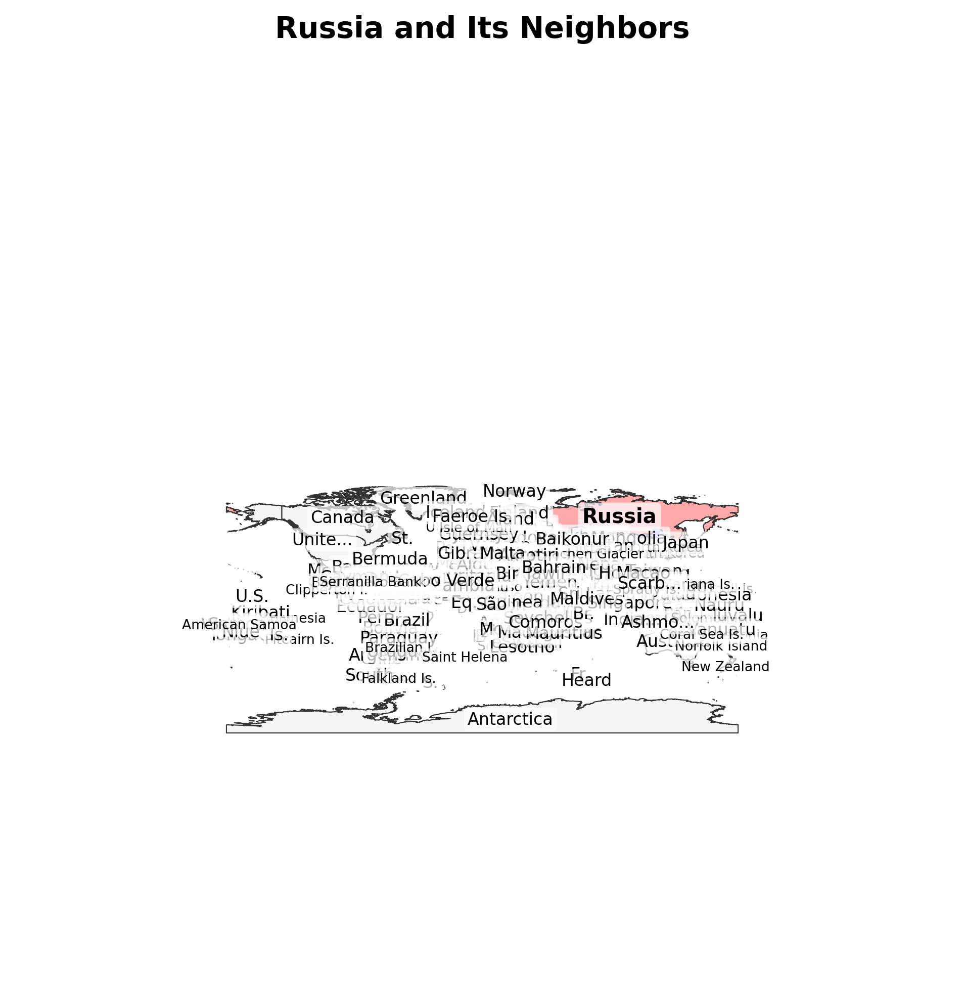
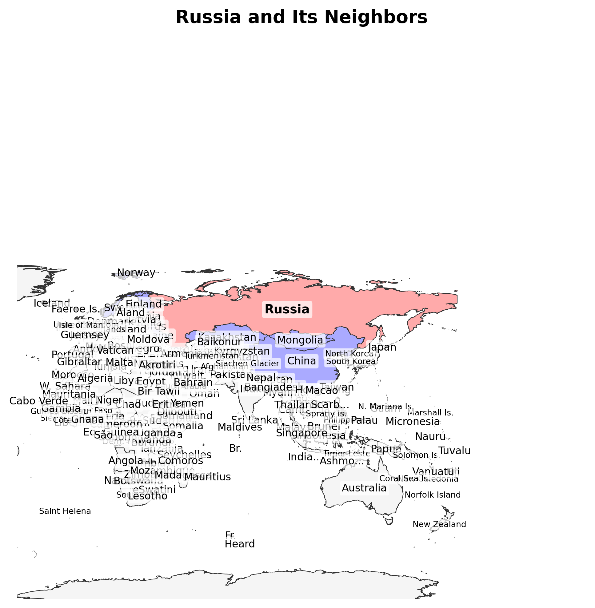
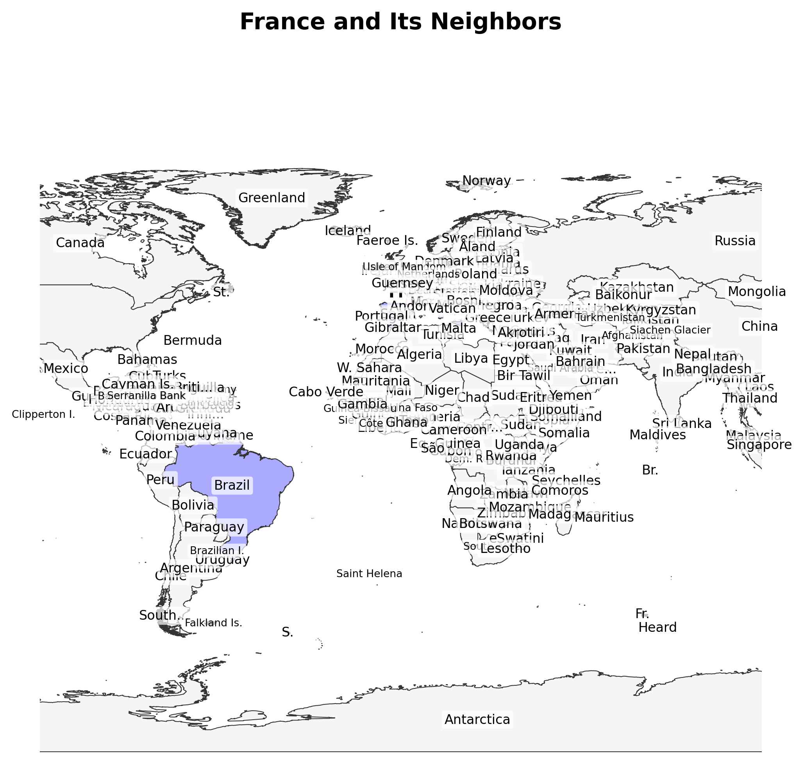
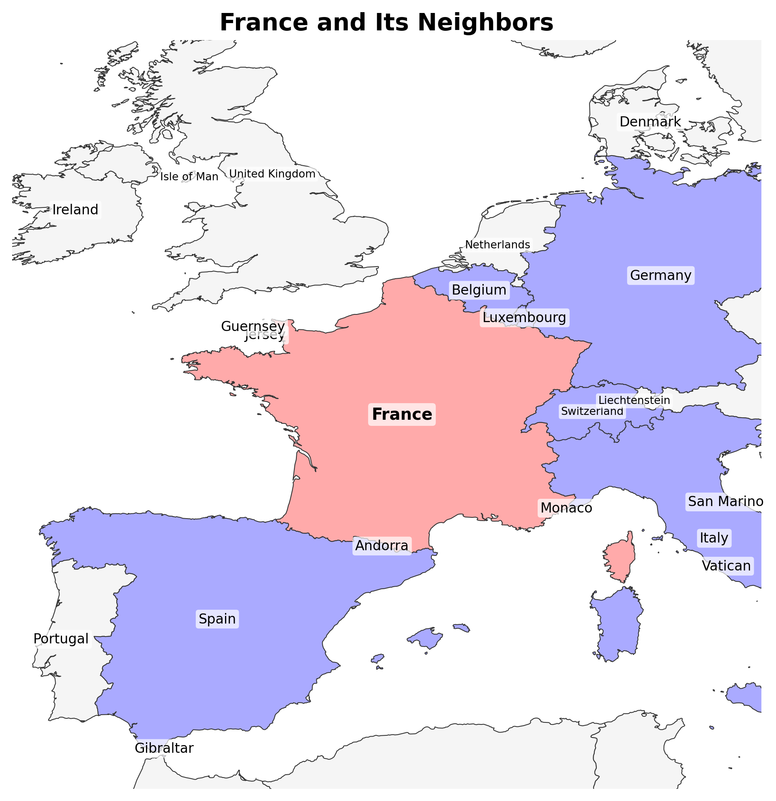
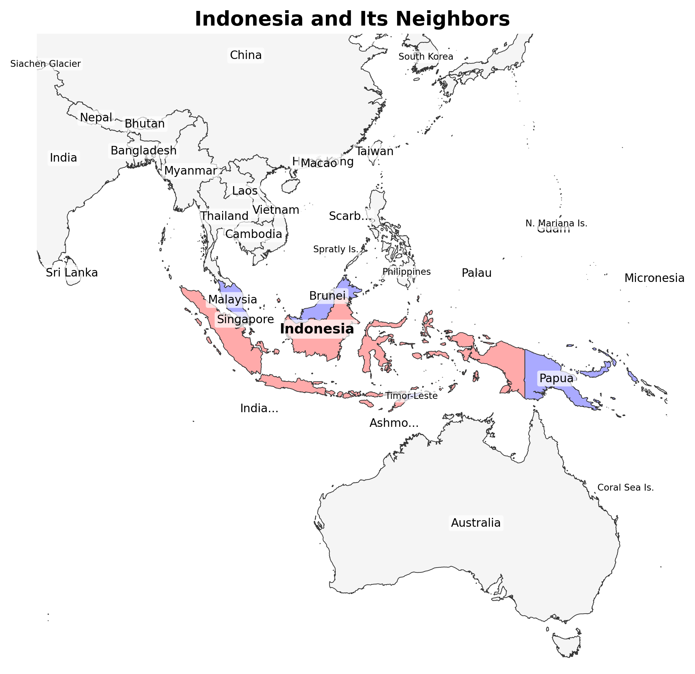
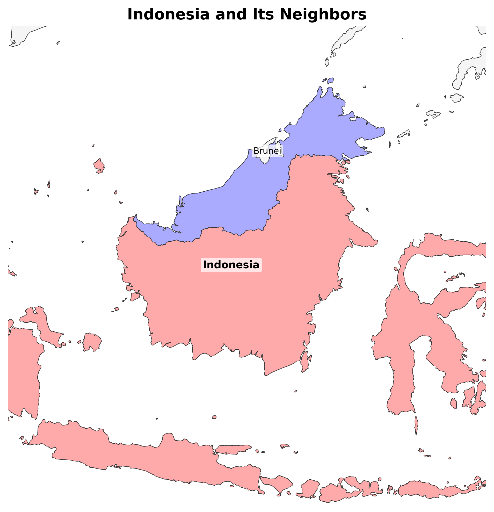

# Maps Package

A Python package for visualizing countries and their neighbors using Natural Earth data.

## Overview

This package provides tools to create map visualizations showing a target country and its neighboring countries. It uses the Natural Earth vector database for geographic data and includes features for analyzing country territories and handling exclaves.

## Installation

1. Clone this repository
2. Set up a virtual environment (optional but recommended)
3. Install the required dependencies:
   ```bash
   pip install -r requirements.txt
   ```

## Usage

### Command Line Interface

The package provides a command-line interface for generating maps and analyzing territories:

```bash
# Basic usage - Generate a map
python -m maps "France"

# Specify output file
python -m maps "Germany" -o germany_map.png

# Specify custom resolution
python -m maps "Italy" --dpi 600

# Include exclaves in the map (by default they're excluded)
python -m maps "Russia" --exclude-exclaves false

# Exclude exclaves (default behavior)
python -m maps "Indonesia" --exclude-exclaves true

# Adjust target country size
python -m maps "Spain" --target-percentage 0.6

# Show territory information in the title
python -m maps "Russia" --show-territory-info

# Use multilingual labels (e.g., French labels)
python -m maps "Germany" --language fr

# List all supported languages
python -m maps --list-languages

# Analyze a country's territory
python -m maps analyze "Indonesia"

# Get territory info in JSON format
python -m maps analyze "Russia" --json
```

For more details on the CLI usage, see the [CLI documentation](docs/cli_usage.md).

### Python API

The package can also be used as a Python API:

```python
import geopandas as gpd
from maps.draw_map import load_country_data
from maps.models import MapConfiguration
from maps.renderer import create_map

# Load country data
countries, target_country, neighbor_names = load_country_data("France", language="fr")

# Create a custom configuration
config = MapConfiguration(
    output_path="france_map.png",
    title="France and Its Neighbors",
    dpi=400,
    target_percentage=0.5,
    exclude_exclaves=True,
    language="fr"  # Set label language to French
)

# Generate the map
create_map(countries, target_country, neighbor_names, config)
```

## Code Structure

The package is organized as follows:

```
maps/
├── __init__.py         # Package initialization
├── __main__.py         # Entry point for python -m maps
├── cli.py              # Command-line interface
├── draw_map.py         # Data loading functions
├── models.py           # Data models and type definitions
├── renderer.py         # Map rendering functions
├── find_neighbors.py   # Functions for finding neighboring countries
├── language_config.py  # Language configuration for multilingual support
└── territory_analyzer.py # Territory analysis functionality

tests/                  # Test suite
  └── maps/             # Test modules
      ├── test_cli.py   # Tests for CLI functionality
      ├── test_draw_map.py # Tests for drawing functions
      ├── test_find_neighbors.py # Tests for neighbor finding
      ├── test_language_support.py # Tests for multilingual support
      └── test_territory_analyzer.py # Tests for territory analysis

docs/                   # Documentation
  ├── cli_usage.md      # CLI usage documentation
  ├── cli_plan.md       # CLI implementation plan
  ├── territory_plan.md # Territory analyzer integration plan
  └── multiling_labels.md # Multilingual label support plan
```

### Module Descriptions

- **models.py**: Defines data classes used throughout the package, such as `MapColors` and `MapConfiguration`.
- **draw_map.py**: Contains functions for loading country data from the Natural Earth database.
- **renderer.py**: Contains functions for rendering maps with matplotlib.
- **find_neighbors.py**: Provides functionality to find neighboring countries.
- **territory_analyzer.py**: Analyzes country territories and classifies them by type.
- **cli.py**: Implements the command-line interface for the package.
- **language_config.py**: Handles configuration and validation for multilingual label support.

## Documentation

- [CLI Usage Guide](docs/cli_usage.md) - Detailed guide on using the command-line interface
- [Territory Analysis](docs/territory_plan.md) - Information about the territory analysis functionality
- [Multilingual Labels](docs/multiling_labels.md) - Documentation on multilingual label support

## Testing

Run the test suite with pytest:

```bash
python -m pytest
```

For more specific tests:

```bash
python -m pytest tests/maps/test_cli.py
python -m pytest tests/maps/test_draw_map.py
python -m pytest tests/maps/test_territory_analyzer.py
python -m pytest tests/maps/test_language_support.py
```

## Requirements

- Python 3.8+
- geopandas
- matplotlib
- shapely
- pandas
- numpy
- pytest (for running tests)

## Features

### Multilingual Label Support

The package supports displaying country labels in different languages. The target country is always specified in English, but the labels on the map can be displayed in any of the 26 supported languages including French, Spanish, German, Russian, Japanese, Chinese, and more.

To use this feature:
- Specify the `--language` or `-l` parameter with a language code (e.g., `fr` for French)
- Run `--list-languages` to see all available language options
- The feature includes fallback to English for any country names that don't have a translation

### Exclave Handling

The package provides functionality to handle country exclaves (territories separated from the main landmass). By default, exclaves are excluded from the map bounds calculation to provide a clearer view of the main territory.

#### Examples of Exclave Handling

##### Russia (with and without exclaves)

<div align="center">
  
  
  <p><i>Left: Russia with all territories including Kaliningrad. Right: Russia with only the main landmass (96.3%).</i></p>
</div>

##### France (with and without exclaves)

<div align="center">
  
  
  <p><i>Left: France with all territories including overseas territories. Right: France with only the main landmass (88.5%).</i></p>
</div>

##### Indonesia (with and without exclaves)

<div align="center">
  
  
  <p><i>Left: Indonesia with all islands. Right: Indonesia with only the largest island (28.1%).</i></p>
</div>

### Territory Analysis

The package includes a territory analyzer that can classify countries based on their geometric properties:

- **Continuous Landmass**: Countries with a single continuous territory (e.g., Israel)
- **Countries with Exclaves**: Countries with significant territories separated from the main landmass (e.g., Russia with Kaliningrad)
- **Island Nations**: Countries composed of multiple islands where no single island represents a dominant portion of the total area (e.g., Indonesia)

Use the `analyze` command to get detailed information about a country's territory:

```bash
python -m maps analyze "Indonesia"
```

## Contributing

Contributions are welcome! Please feel free to submit a Pull Request.

## License

This project is licensed under the MIT License - see the LICENSE file for details.
