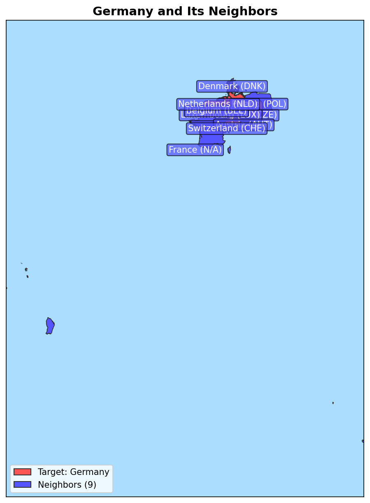
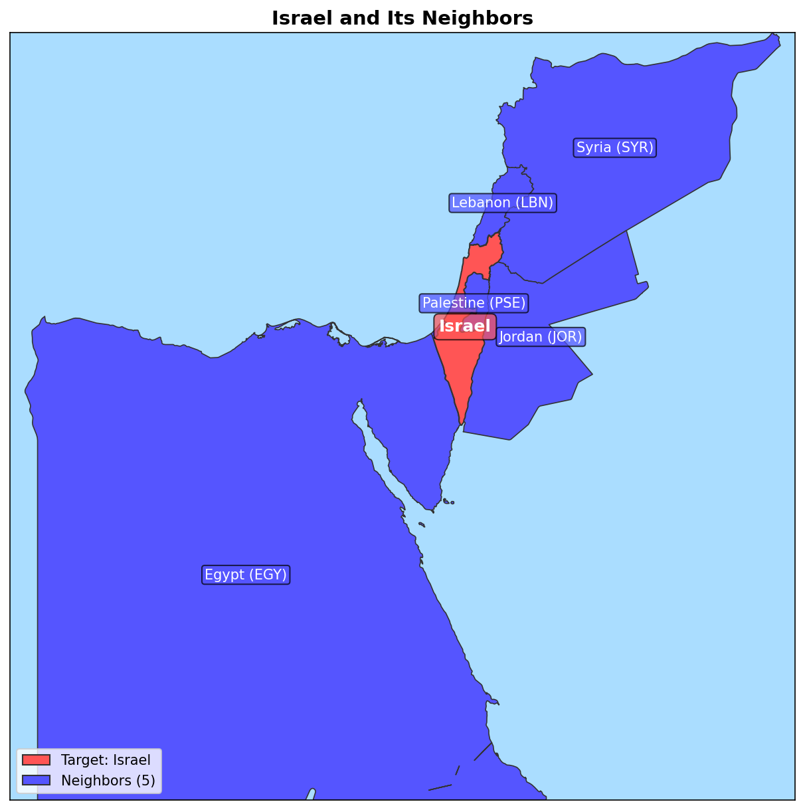
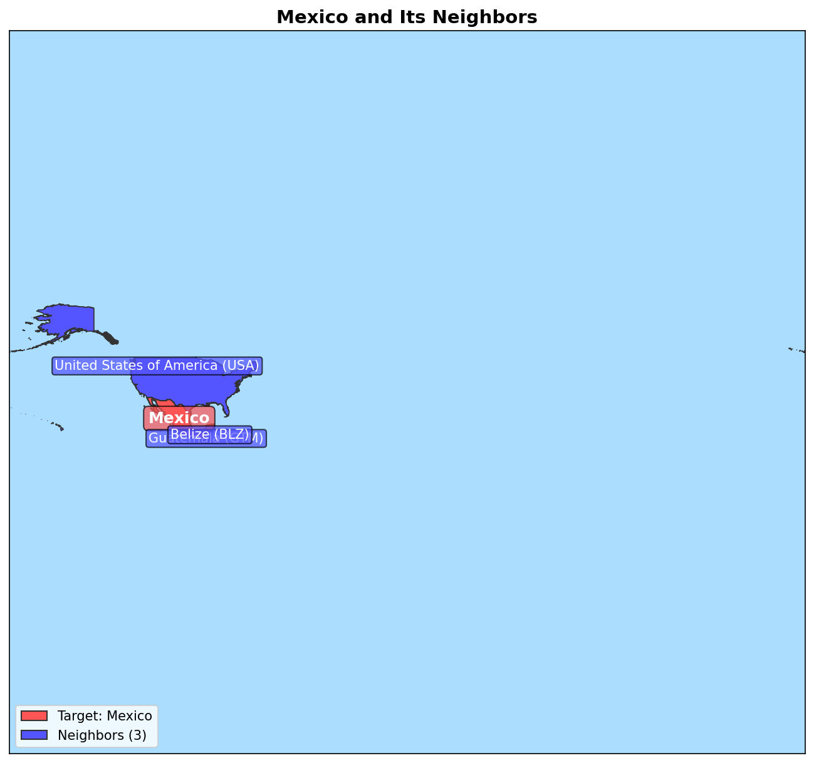
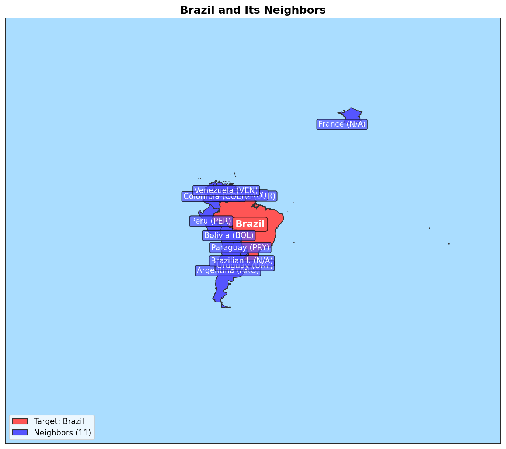
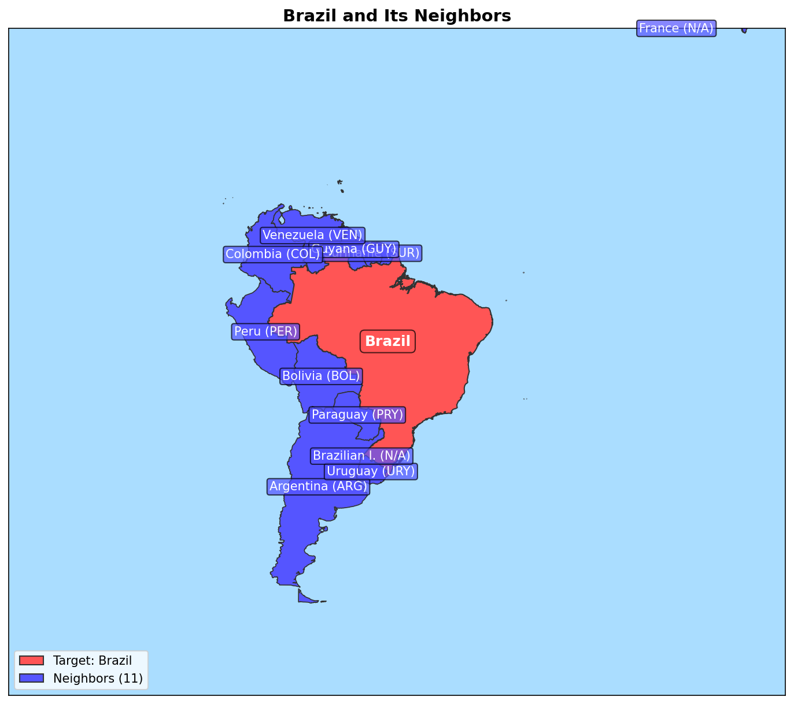
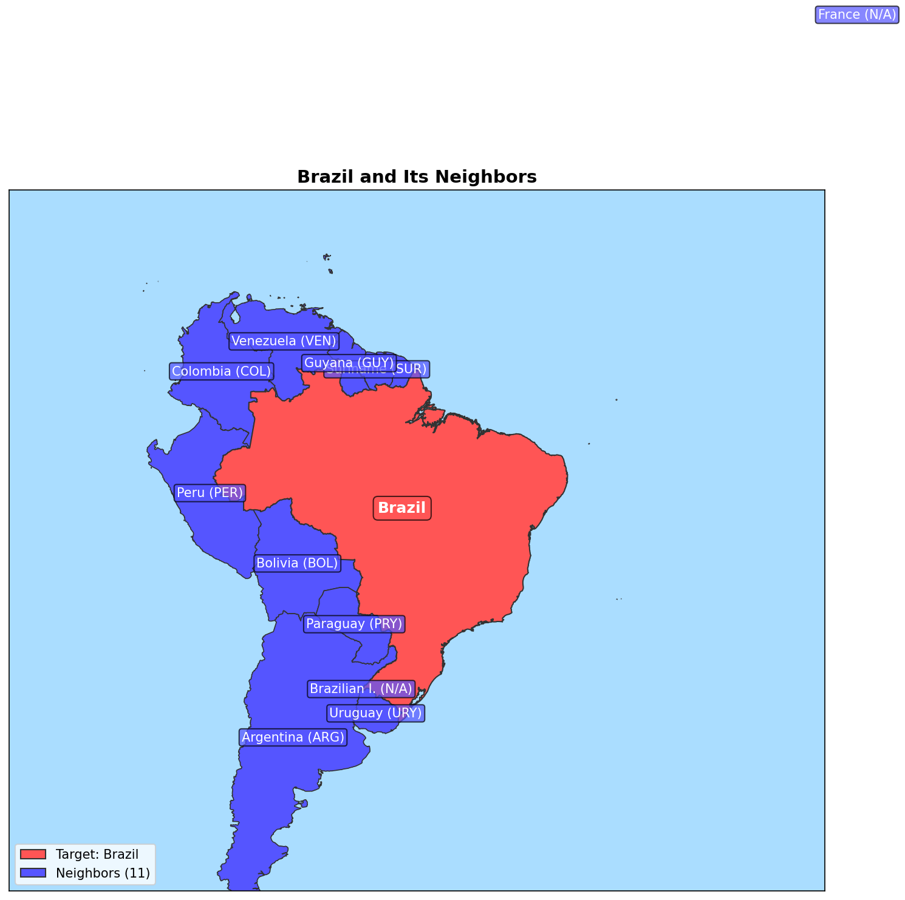
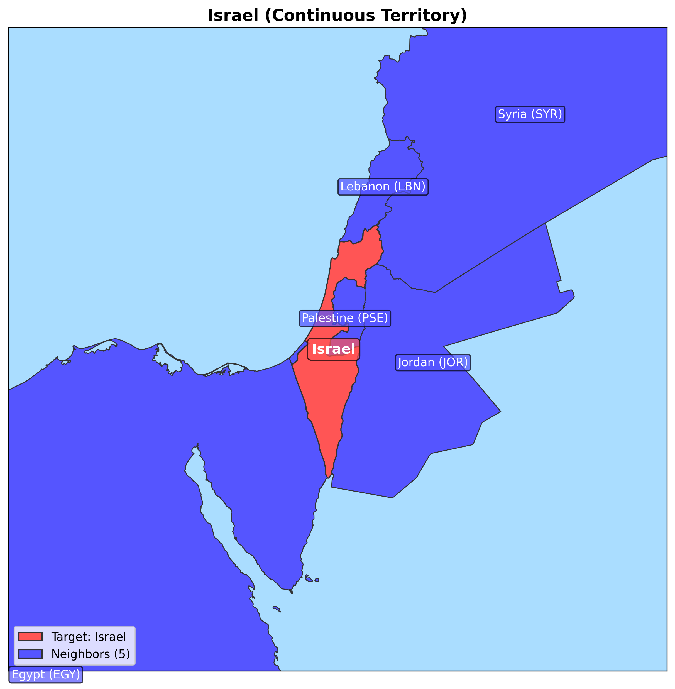
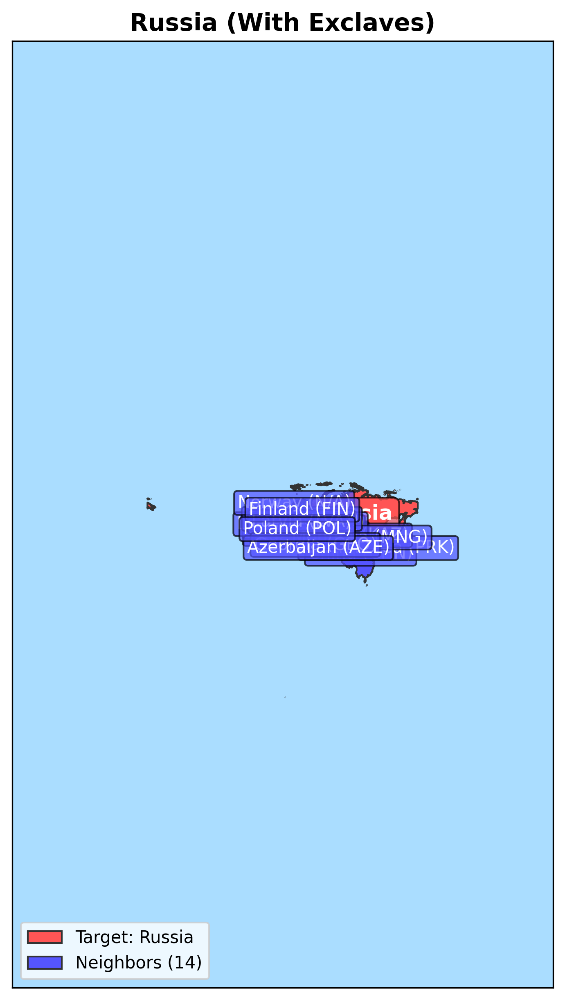
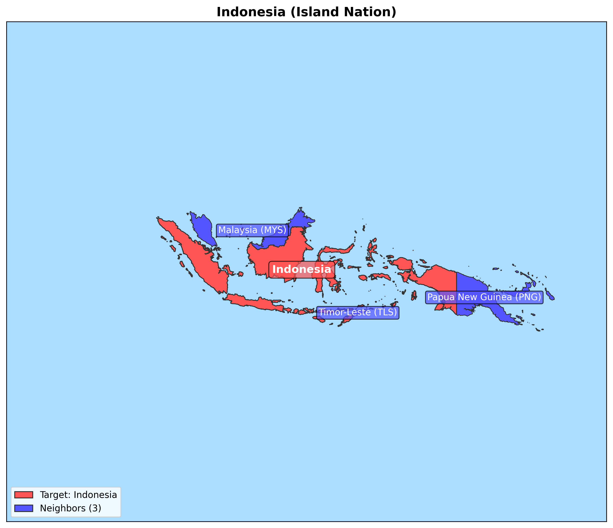

# Maps Visualization Tool

A Python package for creating simple, informative maps showing countries and their neighbors.

<div align="center">
  
  
  
  <p><i>Example maps showing Germany (9 neighbors), Israel (5 neighbors), and Mexico (3 neighbors) with their neighboring countries highlighted.</i></p>
</div>

## Features

- Generate country maps with clear visualization
- Highlight target countries and their neighbors
- Optimized drawing with automatic bounds calculation
- Configurable target country focus (percentage of the map)
- SQLite-based geographic data storage

## Target Percentage Comparison

The tool allows you to control how much of the map area the target country occupies using the `target_percentage` parameter:

<div align="center">
  
  
  
  <p><i>Brazil shown at different target percentages: 20% (left), 40% (middle), and 60% (right) of the map area.</i></p>
</div>

## Installation

### Prerequisites

- Python 3.9 or higher
- SQLite database with geographic data (included)

### Setup

1. Clone the repository:
   ```bash
   git clone https://github.com/username/maps.git
   cd maps
   ```

2. Create a virtual environment:
   ```bash
   python -m venv .venv
   source .venv/bin/activate  # On Windows: .venv\Scripts\activate
   ```

3. Install the package:
   ```bash
   pip install -e .
   ```

4. Install development dependencies (optional):
   ```bash
   pip install -e ".[dev]"
   ```

## Usage

### Basic Example

Generate a map of Germany with default settings:

```python
from draw_map import create_map, MapConfiguration, load_country_data

# Create the map with default target percentage (40%)
config = MapConfiguration(output_path="germany_map.png", title="Germany and Its Neighbors")
countries, target_country, neighbor_names = load_country_data("Germany")
create_map(countries, target_country, neighbor_names, config)
```

### Custom Target Percentage

Control how much of the map the target country occupies:

```python
from draw_map import create_map, MapConfiguration, load_country_data

# Create a map with the target country taking up 60% of the image
config = MapConfiguration(
    output_path="brazil_map.png", 
    title="Brazil and Its Neighbors",
    target_percentage=0.6  # Target country occupies 60% of the map
)
countries, target_country, neighbor_names = load_country_data("Brazil")
create_map(countries, target_country, neighbor_names, config)
```

### Command Line Usage

```bash
# Generate a map for Germany
python draw_map.py Germany

# Generate a map for Israel with custom output path and resolution
python draw_map.py Israel -o israel_map.png --dpi 300

# Generate a map for Brazil with the target country taking up 60% of the image
python draw_map.py Brazil --target-percentage 0.6
```

### Find Neighbors Tool

You can also use the neighbors tool to get information about country borders:

```bash
# List neighboring countries for France
python find_neighbors.py France

# List available countries (limited to 20)
python find_neighbors.py --list

# List all available countries
python find_neighbors.py --list-all
```

## Territory Analyzer

The Maps Visualization Tool includes a territory analysis module that can automatically classify countries based on their geometric properties:

### Territory Types

1. **Continuous Landmass** - Countries with a single continuous territory or where the main territory represents the vast majority of the country's area.

   **Example: Israel**
   
   
   
   Israel is classified as a continuous territory with 100% of its area in a single polygon.

2. **Countries with Exclaves** - Countries with significant territories separated from the main landmass.

   **Example: Russia**
   
   
   
   Russia is identified as having exclaves, with the main territory representing 96.33% of its total area. Notable exclaves include Kaliningrad Oblast between Poland and Lithuania.

3. **Island Nations** - Countries composed of multiple islands where no single island represents a dominant portion of the total area.

   **Example: Indonesia**
   
   
   
   Indonesia is classified as an island nation with 264 separate territories. The largest island represents only 28.14% of the total area.

### Features

- **Automatic Classification** - Countries are automatically classified based on their geometric properties
- **Area Calculations** - Calculate total area, percentage of each separate territory, and identify the main territory
- **Distance Analysis** - Determine maximum distance between separate polygons in a country
- **Detailed Information** - Get comprehensive data on each territory, including area, centroid coordinates, and percentage of total area
- **Customizable Thresholds** - Adjust classification parameters based on your needs

### Using the Territory Analyzer

**In Python:**

```python
# Basic territory analysis
from territory_analyzer import get_country_territory_info

# Get detailed territory information
territory_info = get_country_territory_info("Russia", db_path="natural_earth_vector.sqlite")
print(f"Territory type: {territory_info['territory_type']}")
print(f"Main area percentage: {territory_info['main_area_percentage']:.2f}%")
print(f"Has exclaves: {territory_info['has_exclaves']}")

# Create a map with territory information
from territory_analyzer import add_territory_info_to_map_config
from draw_map import create_map

# Get base map configuration
map_config = {
    "country": "Indonesia",
    "title": "Indonesia"
}

# Add territory information to map
enhanced_config = add_territory_info_to_map_config(map_config, "Indonesia")
create_map(**enhanced_config, output_file="indonesia_with_territory_info.png")
```

**Command Line:**

Use the example script to analyze and create maps for multiple countries:

```bash
python example_territory_map.py "Indonesia,Russia,Israel" --output-dir="output_maps" --db-path="natural_earth_vector.sqlite"
```

Or use the territory analyzer directly:

```bash
python territory_analyzer.py "Russia" --db-path="natural_earth_vector.sqlite" --format="human"
```

## Project Structure

```
maps/
├── docs/
│   └── static/                # Example maps and images
│       ├── germany_map.png
│       ├── israel_map.png
│       └── mexico_map.png
├── tests/
│   ├── conftest.py            # Shared test fixtures
│   └── maps/
│       ├── __init__.py
│       ├── test_draw_map.py   # Tests for drawing functions
│       ├── test_find_neighbors.py # Tests for neighbor lookup
│       └── test_territory_analyzer.py # Tests for territory analyzer
├── __init__.py                # Package initialization
├── draw_map.py                # Main map drawing functionality
├── find_neighbors.py          # Country neighbor lookup
├── territory_analyzer.py      # Territory analysis functionality
├── test_country_types.py      # Territory analysis test script
├── example_territory_map.py   # Enhanced map creation example
├── output_maps/               # Example territory maps
│   ├── israel_territory.png   # Israel (continuous territory)
│   ├── russia_territory.png   # Russia (with exclaves)
│   └── indonesia_territory.png # Indonesia (island nation)
├── natural_earth_vector.sqlite # Geographic database
├── pyproject.toml             # Project configuration
└── README.md                  # This file
```

## Testing

Run the tests with pytest:

```bash
pytest
```

For test coverage report:

```bash
pytest --cov=. --cov-report=html
```

## Contributing

1. Fork the repository
2. Create a feature branch: `git checkout -b feature-name`
3. Commit your changes: `git commit -m 'Add feature'`
4. Push to the branch: `git push origin feature-name`
5. Submit a pull request

## License

This project is licensed under the MIT License - see the LICENSE file for details.

## Territory Analysis

This project includes a territory analysis module that can classify countries based on their geometric characteristics:

- **Continuous Landmass**: Countries with a single continuous territory (e.g., Israel)
- **Countries with Exclaves**: Countries with a main landmass and one or more separate territories (e.g., Russia with Kaliningrad)
- **Island Nations**: Countries composed of multiple significant islands with no dominant landmass (e.g., Indonesia)

### Territory Types Examples

<div align="center">
  
  
  
  <p><i>Examples of different territory types: Israel (continuous landmass), Russia (with exclaves), and Indonesia (island nation).</i></p>
</div>

### Territory Analysis Features

- Automatic classification of country territories
- Calculation of polygon areas and percentages
- Determination of main landmass and exclaves
- Integration with map drawing functionality
- Customizable threshold for classification (default: 80%)

### Territory Analysis Usage

#### Basic Example

```python
from territory_analyzer import TerritoryAnalyzer

# Create an analyzer with default threshold (80%)
analyzer = TerritoryAnalyzer()

# Analyze a country directly from the database
result = analyzer.analyze_from_db("Israel")

# Print the territory type
print(f"Country: {result.country_name}")
print(f"Territory Type: {result.geometry_type.value}")
print(f"Polygon Count: {result.polygon_count}")
```

#### Command Line Usage

Generate territory analysis for specific countries:

```bash
# Analyze Israel (continuous landmass)
python test_country_types.py --countries="Israel"

# Analyze multiple countries
python test_country_types.py --countries="Israel,Russia,Indonesia"

# Customize the threshold for classification
python test_country_types.py --countries="Russia" --threshold=0.9
```

#### Creating Enhanced Maps

Create maps with territory type information:

```bash
# Generate maps for multiple countries
python example_territory_map.py "Israel,Russia,Indonesia" --output-dir="output_maps"
```

The generated maps include territory type information in the title and are optimized for visualizing multiple separate territories.
