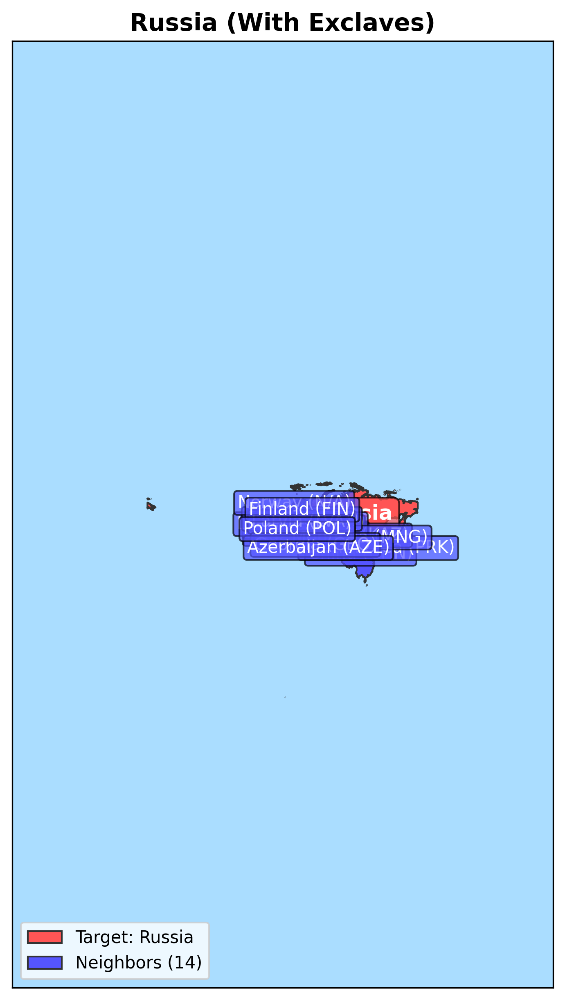
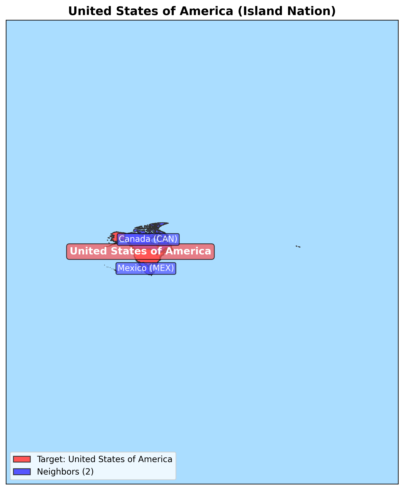

# Maps Package

A Python package for visualizing countries and their neighbors using Natural Earth data.

## Overview

This package provides tools to create map visualizations showing a target country and its neighboring countries. It uses the Natural Earth vector database for geographic data.

The package was refactored from a single script (`draw_map.py`) into a modular package structure (`maps`) to improve maintainability, testability, and extensibility.

## Installation

1. Clone this repository
2. Set up a virtual environment (optional but recommended)
3. Install the required dependencies:
   ```bash
   pip install -r requirements.txt
   ```

## Usage

### Command Line Interface

The package provides a command-line interface for generating maps:

```bash
# Basic usage
python -m maps France

# Specify output file
python -m maps Germany -o germany_map.png

# Specify custom resolution
python -m maps Italy --dpi 600

# Include exclaves in the map
python -m maps Russia --no-exclaves

# Adjust target country size
python -m maps Spain --target-percentage 0.6
```

### Using as a Python Package

```python
import geopandas as gpd
from maps import load_country_data, create_map, MapConfiguration

# Load country data
countries, target_country, neighbor_names = load_country_data("France")

# Create a custom configuration
config = MapConfiguration(
    output_path="france_map.png",
    title="France and Its Neighbors",
    dpi=400,
    target_percentage=0.5,
    exclude_exclaves=True
)

# Generate the map
create_map(countries, target_country, neighbor_names, config)
```

## Project Structure

The package is organized as follows:

```
maps/
├── __init__.py         # Package initialization and exports
├── cli.py              # Command-line interface
├── data_loader.py      # Functions for loading geographic data
├── geometry_processor.py # Geometry processing utilities
├── models.py           # Data models and type definitions
└── renderer.py         # Map rendering functions

tests/                  # Test suite
```

### Module Descriptions

- **models.py**: Defines data classes used throughout the package, such as `MapColors` and `MapConfiguration`.
- **data_loader.py**: Contains functions for loading country data from the Natural Earth database.
- **geometry_processor.py**: Provides utilities for processing geometries, including handling exclaves and calculating map bounds.
- **renderer.py**: Contains functions for rendering maps with matplotlib.
- **cli.py**: Implements the command-line interface for the package.

## Backward Compatibility

For backward compatibility, the original `draw_map.py` script has been maintained and updated to use the new modular components. This ensures that existing code and tests that depend on the original interface continue to work.

Users are encouraged to migrate to the new package interface for new projects.

## Testing

Run the test suite with pytest:

```bash
python -m pytest tests/maps
```

## Requirements

- Python 3.8+
- geopandas
- matplotlib
- shapely
- pandas
- numpy
- pytest (for running tests)

## Features

- Generate country maps with clear visualization
- Highlight target countries and their neighbors
- Optimized drawing with automatic bounds calculation
- Configurable target country focus (percentage of the map)
- SQLite-based geographic data storage

## Target Percentage Comparison

The tool allows you to control how much of the map area the target country occupies using the `target_percentage` parameter:

<div align="center">
  
  
  
  <p><i>Brazil shown at different target percentages: 20% (left), 40% (middle), and 60% (right) of the map area.</i></p>
</div>

## Territory Analyzer

The Maps Visualization Tool includes a territory analysis module that can automatically classify countries based on their geometric properties:

### Territory Types

1. **Continuous Landmass** - Countries with a single continuous territory or where the main territory represents the vast majority of the country's area.

   **Example: Israel**
   
   
   
   Israel is classified as a continuous territory with 100% of its area in a single polygon.

2. **Countries with Exclaves** - Countries with significant territories separated from the main landmass.

   **Example: Russia**
   
   
   
   Russia is identified as having exclaves, with the main territory representing 96.33% of its total area. Notable exclaves include Kaliningrad Oblast between Poland and Lithuania.

3. **Island Nations** - Countries composed of multiple islands where no single island represents a dominant portion of the total area.

   **Example: Indonesia**
   
   
   
   Indonesia is classified as an island nation with 264 separate territories. The largest island represents only 28.14% of the total area.

### Features

- **Automatic Classification** - Countries are automatically classified based on their geometric properties
- **Area Calculations** - Calculate total area, percentage of each separate territory, and identify the main territory
- **Distance Analysis** - Determine maximum distance between separate polygons in a country
- **Detailed Information** - Get comprehensive data on each territory, including area, centroid coordinates, and percentage of total area
- **Customizable Thresholds** - Adjust classification parameters based on your needs

### Using the Territory Analyzer

**In Python:**

```python
# Basic territory analysis
from territory_analyzer import get_country_territory_info

# Get detailed territory information
territory_info = get_country_territory_info("Russia", db_path="natural_earth_vector.sqlite")
print(f"Territory type: {territory_info['territory_type']}")
print(f"Main area percentage: {territory_info['main_area_percentage']:.2f}%")
print(f"Has exclaves: {territory_info['has_exclaves']}")

# Create a map with territory information
from territory_analyzer import add_territory_info_to_map_config
from draw_map import create_map

# Get base map configuration
map_config = {
    "country": "Indonesia",
    "title": "Indonesia"
}

# Add territory information to map
enhanced_config = add_territory_info_to_map_config(map_config, "Indonesia")
create_map(**enhanced_config, output_file="indonesia_with_territory_info.png")
```

**Command Line:**

Use the example script to analyze and create maps for multiple countries:

```bash
python example_territory_map.py "Indonesia,Russia,Israel" --output-dir="output_maps" --db-path="natural_earth_vector.sqlite"
```

Or use the territory analyzer directly:

```bash
python territory_analyzer.py "Russia" --db-path="natural_earth_vector.sqlite" --format="human"
```

## Exclave Exclusion Feature

The Maps Visualization Tool can automatically exclude exclaves (detached territories) from the map visualization, providing a cleaner and more focused view of a country's main territory. This is particularly useful for countries with distant territories that would otherwise make the map too zoomed out.

### How It Works

When the `exclude_exclaves` option is enabled (which is the default):

1. Only the main landmass of the target country is used for determining map bounds
2. Neighbors that only border exclaves are excluded from the map visualization
3. All territories are still shown on the map, but the view is centered and zoomed on the main territory

### Exclave Exclusion Examples

<div align="center">
  <div>
    
    
    <p><i>Russia shown with exclaves included (left) vs excluded (right). Note how Poland and Lithuania are excluded in the right map as they only border the Kaliningrad exclave.</i></p>
  </div>
  
  <div>
    
    
    <p><i>United States shown with exclaves included (left) vs excluded (right). Alaska and other territories are still visible but the map focuses on the contiguous states.</i></p>
  </div>
</div>

### Using the Exclave Exclusion Feature

By default, exclaves are excluded from map bounds calculations. You can control this behavior:

**In Python:**

```python
from draw_map import create_map, MapConfiguration, load_country_data

# Default behavior - exclude exclaves
config = MapConfiguration(
    output_path="russia_map.png", 
    title="Russia and Its Neighbors",
    exclude_exclaves=True  # This is the default
)

# Include exclaves in bounds calculation
config_with_exclaves = MapConfiguration(
    output_path="russia_with_exclaves.png", 
    title="Russia and All Its Neighbors",
    exclude_exclaves=False
)

# Create the maps
countries, target_country, neighbor_names = load_country_data("Russia")
create_map(countries, target_country, neighbor_names, config)
create_map(countries, target_country, neighbor_names, config_with_exclaves)
```

**Command Line:**

```bash
# Default - exclude exclaves
python example_territory_map.py "Russia" --output-dir="output_maps"

# Include exclaves in bounds calculation
python example_territory_map.py "Russia" --output-dir="output_maps" --include-exclaves
```

### Benefits of Exclave Exclusion

1. **Better Focus**: Maps focus on the main territory where most of the population and land area is located
2. **Clearer Visualization**: Without distant exclaves, the map can use more screen space to show details of the main territory
3. **Relevant Neighbors**: Only countries that border the main territory are highlighted, avoiding confusion with neighbors that only border exclaves
4. **Consistent Scale**: Maps maintain a consistent scale appropriate for the main landmass

## Territory Analysis

This project includes a territory analysis module that can classify countries based on their geometric characteristics:

- **Continuous Landmass**: Countries with a single continuous territory (e.g., Israel)
- **Countries with Exclaves**: Countries with a main landmass and one or more separate territories (e.g., Russia with Kaliningrad)
- **Island Nations**: Countries composed of multiple significant islands with no dominant landmass (e.g., Indonesia)

### Territory Types Examples

<div align="center">
  
  
  
  <p><i>Examples of different territory types: Israel (continuous landmass), Russia (with exclaves), and Indonesia (island nation).</i></p>
</div>

### Territory Analysis Features

- Automatic classification of country territories
- Calculation of polygon areas and percentages
- Determination of main landmass and exclaves
- Integration with map drawing functionality
- Customizable threshold for classification (default: 80%)

### Territory Analysis Usage

#### Basic Example

```python
from territory_analyzer import TerritoryAnalyzer

# Create an analyzer with default threshold (80%)
analyzer = TerritoryAnalyzer()

# Analyze a country directly from the database
result = analyzer.analyze_from_db("Israel")

# Print the territory type
print(f"Country: {result.country_name}")
print(f"Territory Type: {result.geometry_type.value}")
print(f"Polygon Count: {result.polygon_count}")
```

#### Command Line Usage

Generate territory analysis for specific countries:

```bash
# Analyze Israel (continuous landmass)
python test_country_types.py --countries="Israel"

# Analyze multiple countries
python test_country_types.py --countries="Israel,Russia,Indonesia"

# Customize the threshold for classification
python test_country_types.py --countries="Russia" --threshold=0.9
```

#### Creating Enhanced Maps

Create maps with territory type information:

```bash
# Generate maps for multiple countries
python example_territory_map.py "Israel,Russia,Indonesia" --output-dir="output_maps"
```

The generated maps include territory type information in the title and are optimized for visualizing multiple separate territories.
